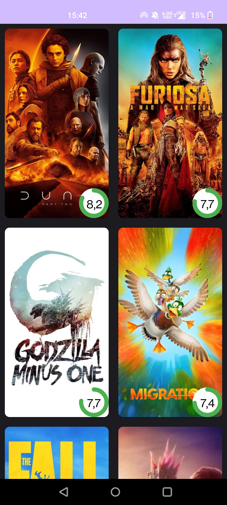
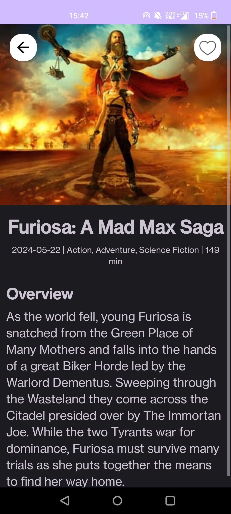
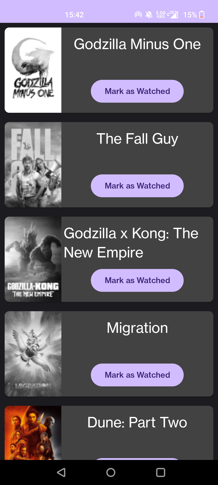
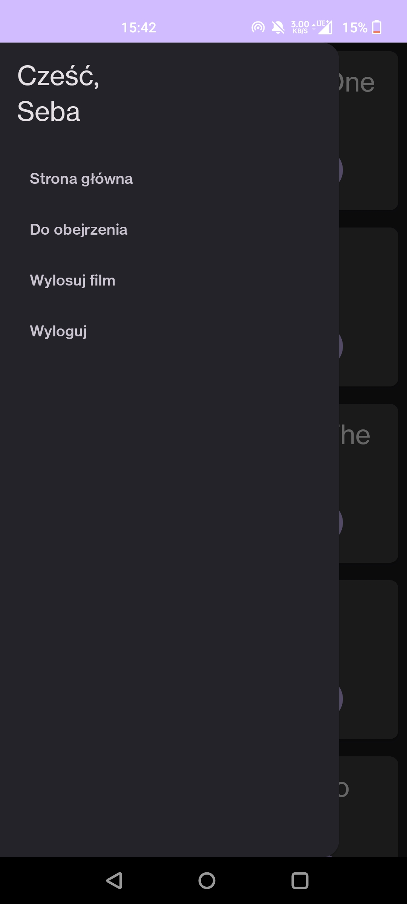

# Mobile Applications Project

Simple app in Kotlin managing movies.

App uses https://www.themoviedb.org/ API to request popular movies and present them on main page as cards. After clicking on image we are moved to detail page containg description, release date and genres.

Movies can be added to your account which is created with Firebase Authentication and then with use of Firebase Realtime Database movies ids are added to database connected to your account.

